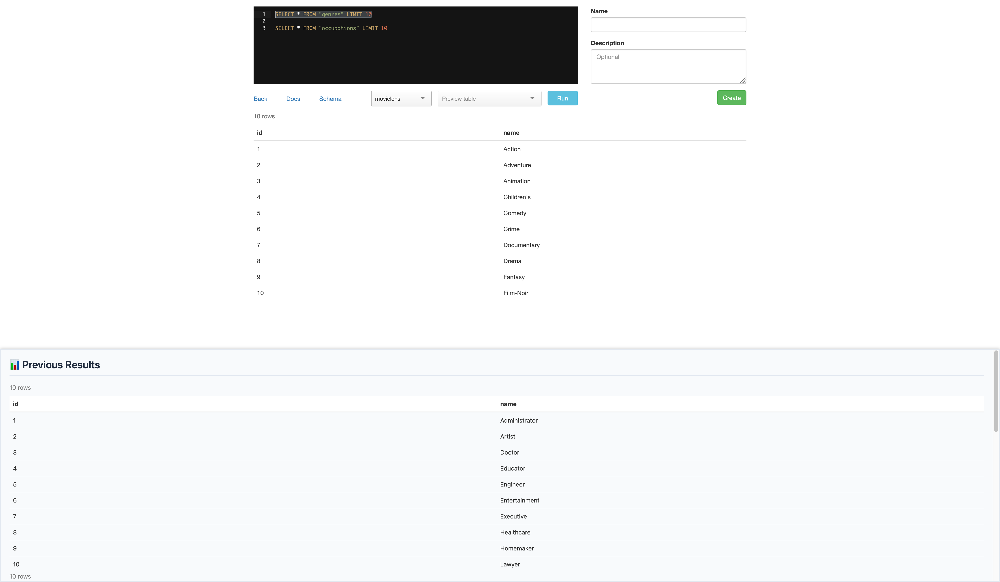

# greasemonkey-userscripts

Greasemonkey userscripts for various websites.

## Blazer

Blazer is a really useful tool to query your databases: https://github.com/ankane/blazer
This script will show you the results from previous queries in a sticky pane at the bottom.

